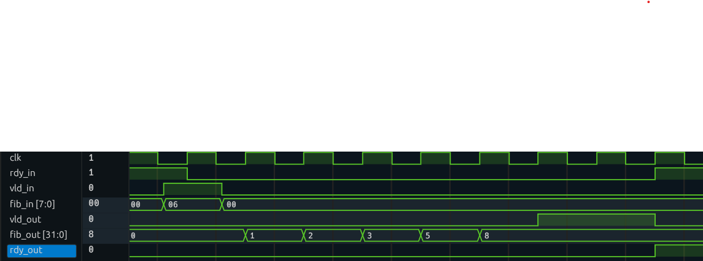

Welcome to your first lab in Open Source ASIC Design!

# Getting Started
At this point, you should have followed the [Docker Installation](https://github.com/Cal-Poly-Open-Source-ASIC-Class) instructions and have already cloned the [Asic Tools](https://github.com/Cal-Poly-Open-Source-ASIC-Class/asic-tools) repository. 

- Start by __using this template__, __not__ cloning it. This will create a copy that you own.
- Then, clone __your copy__ into the `workspace`  folder. In other words, make sure you are in `~/workspace`, and then `git clone <your forked copy.git>`
>#### Using as Template:
>

>#### Cloning:
>

# Lab 1 Specification

## Part 1 - RTL Design
Your task is to design a Fibonacci accelerator.

### Setup
 Create a directory named `rtl`, and create a system verilog file inside it with a name ending in `.sv`. From within `lab1`, the path should be `rtl/<modulename>.sv`. 

> [!NOTE]
> Any time you see a name in brackets, it means replace that name with your own. For example, `<module_name>.sv` would be replaced with `fib.sv` if your module is named `fib`.

### System Inputs:
- `clk`, assume positive edge triggers
- `rst_n`, an active low synchronous reset
    - Resets when signal is 0, and only on a clock edge
- `fib_in`, the nth Fibonacci number to calculate
    - This input should be a parameterized width, defaulted to 8 bits
- `vld_in`, valid in
    - goes high when fib_in is valid, indicating to start a new calculation
    - Controlled by whatever device interacts with the accelerator, or by the testbench
- `rdy_out`, ready out
    - goes high when the accelerator's output has successfully been read from 

### System Outputs:
- `rdy_in`, held high by the accelerator when it is ready to take a new input
- `fib_out`, the final result of the calculated nth fibonacci number
    - this output should have a parameterized width, defaulted to 32.
- `vld_out`, held high by the accelerator when its output is ready

### Understanding the Transactions
- If the accelerator is ready to take a new input, it should hold `rdy_in` high.
- A transaction begins when the controller/testbench sets `vld_in` high and writes data to `fib_in`
- The controller/testbench waits for `vld_out` from the accelerator, indicating it can read the resulting `fib_out`.
- The accelerator holds its output as it waits for `rdy_out`, indicating that the controller/testbench has read the output. The transaction is now complete.

Example Waveform:


Note that `fib_out` does not necessarily have to increment as shown in this waveform; its state only matters when `vld_out` is high.

### Docker Container

From here on out, all commands should be run from within the docker container.

### Linting
Now that you have started writing your design, it is time to lint it. This will catch errors such as missed semicolons, unmatched bit widths and types, and issues that may come up later down the line. We will be using the tool Verilator for linting.

Run:

```
verilator --lint-only --timing <your_verilog_file.sv>
```

It is good to get in the habit of linting every time you are done writing code. If your code is free of lint errors, the above command will give no output.

It would be a pain to type that every time, so the provided Makefile makes linting easier:
```
make lint
```


## Part 2 - Testbench & Simulation

With your first draft design complete, it is time to test. Create a directory `tests/<testname>`. In that directory, create a test file. Your ultimate path should be `tests/<testname>/<testname>.sv`. Make sure the module name matches the file name as well.

> [!IMPORTANT]  
> It is important to put seperate tests in their own directories, as later on tests might involve more than one system verilog file. It would create quite a mess to have a bunch of semi-overlapping tests in the same directory.

### Simulate with Verilator, Manually

Now we can use verilator to compile and run our tests.
```
verilator --timing --trace --binary tests/<testname>/<testname>.sv -I"rtl"
```
> [!NOTE]
> What are all these flags doing?
> - Timing lets verilator simulate delays like `#1`
> - Binary tells verilator to make a runnable test file
> - Trace tells verilator to save simulation results to a waveform.
> - `-I` tells verilator to include the following directory when looking for RTL files, enabling it to look in the `rtl` folder

This creates a binary file in obj_dir called `V<testname>`. Run the test by executing the binary using `./obj_dir/V<testname>`. If you `ls obj_dir`, it should be the only executable, green item. If you type `./obj_dir/` and hit tab, it should autocomplete.

Running the binary should create a waveform dump file, that ends with `.vcd`. To view the waveform, you can:
- Open this file in VSCode with the Surfer extension
- `surfer <name>.vcd` to use surfer through docker to view it. Surfer is newer, smoother, but has less features.
- `gtkwave <name>.vcd` to use GTKWave through docker to view it. GTKWave is older and clunkier, but with more features like searching for values

### Simulate with Verilator, Automatically
That was a lot of commands to type to run one simulation. Luckily, the provided Makefile knows how to do that, using:
- `make tests` to run all tests
- `make tests/<test_name>` to run a specific test

This will leave a waveform `.vcd` file and a `results.txt` log file in the directory of each test being ran.

>[!NOTE]
> For the makefile to automatically find your tests, they must be named uniquely and follow the filepath of:
```tests/<testname>/<testname>.sv```

### Simulate with Icarus (iverilog), Manually

Icarus verilog is the second simulator we will be using to test our designs. It adds functionality that verilator does not have, including:
- `X` values for undefined or uninitialized values
- `Z` values for High Z or tri-state signals, where a signal can be high, low, or undriven

We use `verilator` first because it is faster and stricter on linting. We use `iverilog` second to catch uninitialized states and issues that `verilator` can miss from assuming every values is a 0 or 1.

First, build your testbench with:
```
iverilog -g2012 rtl/<rtl_name>.sv tests/<test_dir>/<test_name>.sv
```
> [!NOTE]
> What are all these flags doing?
> - `-g2012` enables system verilog instead of just verilog, as per the IEEE 2012 verilog spec.

This creates a binary called `a.out`, run it with:
```
./a.out
```

### Simulate with Icarus (iverilog), Automatically
The provided Makefile automates testing:
- `make itests` to run all tests with Icarus
- `ICARUS=1 make tests/<test_name>` to run a specific test

This will leave a waveform `.vcd` file and a `results.txt` log file in the directory of each test being ran.

## Testbench Features
So you have a basic testbench and you can view waveforms.

1. First, make sure your tests can fail. Use Assert statements to check conditions programatically.
```
$assert (A == B) else $error("Failed. A: %d, B: %d", A, B);
```
2. Use a __[task](https://vlsiverify.com/system-verilog/tasks/)__ to abstract the process of writing a value to the accelerator and reading its response. 
    - A task is like a function that can impact the simulation state. It can drive inputs and have delays.
    - Define it within the scope of the module, so that it can drive signals into your accelerator.
3. Use a __[function](https://www.chipverify.com/systemverilog/systemverilog-functions)__ to compute the expected value of an Nth fibonacci number. 
4. Use a for loop to compare the function and task outputs using an assert. This way, you can automatically test as many inputs as you want!

# Deliverables
1. In-Lab Waveform Demo
    - Demo tests running with both verilator and icarus
1. Github Link to your copy of lab1
    - SV Code for your accelerator
    - SV Testbench with all [testbench features](#testbench-features)
